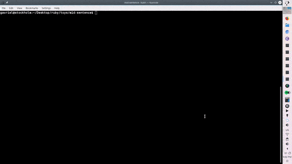

# mid-sentence
Naive Mid-Sentence Processing



I've implemented a small ruby script for the command line that repeatedly runs the link grammar parser every time a character is entered or deleted. To read more, check out [this post](https://gavrieltal.github.io/2018/08/14/link-grammar/)

To run this program on your own Mac or Linux terminal, you'll need to install `ruby`, the command line tool `gem`, and the `linkparser` gem. On Debian/Ubuntu/derivatives, that should look like:
```
sudo apt-get install ruby gem

sudo gem install linkparser
```
To use sudo, you will need to enter your root-level password.

Then, you can use `git clone` from my [Github Repository]() or copy the code below into a file, and run it like so, assuming the file's name is _mid-sentence.rb_:

```
ruby mid-sentence.rb
```

Hit Escape to exit the program.